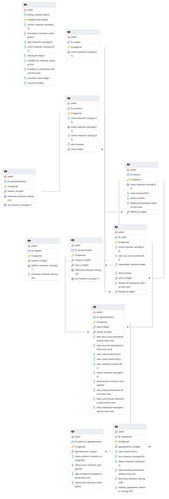

# Desafio Dunnas — Sistema de Gerenciamento de Reserva de Salas

## Sumário

- Visão geral do sistema
- Funcionalidades por papel (Admin, Recepcionista, Cliente)
- Arquitetura (Stack e MVC)
- Estrutura de pastas do projeto
- Modelo de dados (diagrama e tabelas)
- Regras de negócio: no Banco vs na Aplicação
- Fluxos principais (agendar, confirmar, finalizar, cancelar)
- Relatórios e caixa
- Setup: build, execução, credenciais, migrações
- Decisões de arquitetura
- Endpoints/Views principais
- Como contribuir e próximos passos

---

## Visão geral

Este projeto implementa um sistema de reservas de salas com três papéis: `Administrador`, `Recepcionista` e `Cliente`. A aplicação usa Spring Boot (Java) com JSP para views e PostgreSQL com Flyway para versionamento do banco. Mais de 50% da lógica de negócio está implementada diretamente no banco de dados (functions, procedures e triggers), conforme os requisitos do desafio.

## Stack e arquitetura

- Backend: `Java 21 + Spring Boot 3`
- View: `JSP (Jakarta JSP + JSTL)`
- Banco de dados: `PostgreSQL`
- Versionamento de BD: `Flyway` com scripts em `src/main/resources/db/migration`
- Segurança: `Spring Security` com autenticação baseada em papéis
- Build/execução: `Maven`

Padrão MVC:

- Controllers em `src/main/java/com/example/desafio_dunnas/controller`
- Services em `.../service` delegam operações de negócio para o banco via repositórios
- Repositories em `.../repository` (JPA + queries nativas para chamar procedures)
- Models (JPA Entities) em `.../model`
- Views JSP em `src/main/webapp/WEB-INF/jsp`

## Estrutura de pastas do projeto

- `src/main/java/com/example/desafio_dunnas/`
  - `controller/`: recebe requisições HTTP, aplica autorização, aciona serviços e retorna Views JSP.
  - `service/`: orquestra a lógica de aplicação, valida entradas básicas e delega operações críticas ao banco via repositórios.
  - `repository/`: interfaces Spring Data JPA; usa queries nativas para chamar procedures/functions do banco.
  - `model/` (ou `entity/`): mapeamento JPA das tabelas (Entidades e relacionamentos).
- `src/main/resources/`
  - `application.properties`: configurações do Spring, datasource, Flyway e ViewResolver.
  - `db/migration/`: scripts Flyway versionados (V1**...V28**) com schema, regras e dados de exemplo.
  - `templates/`: recursos auxiliares (se aplicável) e estáticos.
- `src/main/webapp/WEB-INF/jsp/`: páginas JSP separadas por papel (admin, recepcionista, cliente).
- `src/test/java/`: testes unitários/de integração (quando presentes).
- `pom.xml`: dependências e plugins Maven.
- `mvnw`, `mvnw.cmd`: wrappers Maven para build reprodutível.

Escolhas de arquitetura

- MVC no Spring: separa claramente camadas de entrada (controllers), orquestração (services) e acesso a dados (repositories), mantendo Views desacopladas.
- Regras críticas no banco: garante consistência, concorrência e atomicidade próximas aos dados; a aplicação chama procedures de alto nível.
- JSP + JSTL: escolha simples e integrada ao Spring Boot para o desafio; fácil renderização server-side.
- Flyway: versiona o banco, reproduzindo o ambiente com segurança e auditabilidade.
- Soft delete em entidades sensíveis (salas/setores) para preservar histórico sem quebrar FKs.

## Funcionalidades por papel

- Administrador
  - CRUD de setores, salas e recepcionistas
  - Soft delete de setores/salas; reativação de setor
  - Visualização e relatórios globais
- Recepcionista
  - Abrir/fechar setor (com regras de integridade)
  - Gerenciar agendamentos do seu setor: listar, confirmar, finalizar, cancelar (com regras)
  - Agendamento instantâneo (cria + confirma)
  - Relatórios do setor e visão do caixa
- Cliente
  - Autocadastro e login
  - Visualização de setores/salas disponíveis
  - Solicitação de agendamento (status `SOLICITADO` até a confirmação)

## Modelo de dados (resumo)

Tabelas centrais:

- `tb_cargos`, `tb_usuarios` (autenticação/roles) + `tb_administradores`, `tb_recepcionistas`, `tb_clientes`
- `tb_setores` (caixa, aberto/fechado, soft delete)
- `tb_salas` (valor_por_hora, capacidade, ativa, setor_id, soft delete)
- `tb_agendamentos` (sala, cliente, início/fim, valores, status, datas)
- `tb_transacoes` (agendamento, valor, tipo `SINAL|PAGAMENTO_FINAL|REEMBOLSO`, status)
- `tb_historico_agendamentos` (auditoria de mudanças de status)

### Diagrama ER

O diagrama entidade-relacionamento (extraído do PostgreSQL) está abaixo para referência rápida das relações entre tabelas:



Principais relações:

- `tb_setores` 1..N `tb_salas`
- `tb_salas` 1..N `tb_agendamentos`
- `tb_clientes` 1..N `tb_agendamentos`
- `tb_agendamentos` 1..N `tb_transacoes`

## Regras de negócio (Banco vs Aplicação)

Principais regras no Banco (functions/procedures/triggers):

- Criação/validação de agendamentos: `pr_create_agendamento`, `fn_verificar_sala_disponivel`, `fn_verificar_conflito_agendamento`
- Confirmação: `pr_confirmar_agendamento` com criação/validação de `SINAL` e timestamp; `fn_validar_confirmacao_agendamento`
- Finalização: `pr_finalizar_agendamento` cria `PAGAMENTO_FINAL` confirmado; `fn_validar_finalizacao_agendamento` impede finalização antes do início e fora de ordem
- Cancelamento: `pr_cancelar_agendamento` permite SOLICITADO e CONFIRMADO antes do início; gera `REEMBOLSO`
- Crédito/débito de caixa por transações confirmadas: trigger `tr_transacao_confirmada_credito` credita (SINAL/PAGAMENTO_FINAL) ou debita (REEMBOLSO) diretamente em `tb_setores`
- Abertura/fechamento de setor: `pr_abrir_setor`, `pr_fechar_setor` (bloqueia fechar com agendamentos ativos)
- Soft delete: `pr_soft_delete_sala`, `pr_soft_delete_setor`, `pr_reativar_setor`; valida ausência de agendamentos ativos para excluir; atualização de validations para ignorar registros soft deleted
- Cálculos financeiros: `fn_calcular_valor_total_por_horas` (proporcional por minuto), `fn_calcular_valor_sinal_por_horas`, `fn_calcular_valor_restante_por_horas`
- Auditoria: `tr_historico_agendamento` grava mudanças de status e `tr_timestamp_agendamento` preenche datas
- Relatórios: `fn_relatorio_agendamentos_setor`, `fn_relatorio_transacoes_setor`, `fn_resumo_financeiro_setor`, `fn_estatisticas_ocupacao_sala`

Regras na Aplicação (Spring):

- Autenticação/Autorização via Spring Security (papéis: ADMIN, RECEPCIONISTA, CLIENTE)
- Orquestração de telas/fluxos (Controllers + Services)
- Consultas paginadas e listagens (JPA Repositories)
- Validações simples de formulário antes de delegar a procedures
- Chamada das procedures nativas para operações sensíveis (criar, confirmar, finalizar, cancelar, abrir/fechar)

Com isso, >50% da lógica de negócio reside no banco, atendendo ao desafio.

## Fluxos principais

1. Solicitação de agendamento (Cliente)

- O cliente escolhe uma sala ativa de um setor aberto e informa data/hora de início e fim.
- O sistema valida: horários no futuro, fim depois do início e ausência de conflito com agendamentos já confirmados para a mesma sala.
- Se tudo estiver ok, o agendamento é criado com status `SOLICITADO` e os valores são calculados proporcionalmente ao período (total, sinal de 50% e restante).

2. Confirmação de agendamento (Recepcionista)

- O recepcionista vê as solicitações do seu setor e pode confirmar agendamentos que ainda não começaram e cujo setor esteja aberto.
- Ao confirmar, o status muda para `CONFIRMADO`, o pagamento de sinal é registrado e a data de confirmação é gravada. O caixa do setor é atualizado com o valor do sinal.
- Não é possível confirmar se o horário de início já passou ou se o setor estiver fechado.

3. Finalização da utilização (Recepcionista)

- Disponível apenas para agendamentos `CONFIRMADO` cujo horário de início já passou.
- O sistema impede finalizar fora de ordem: se existir um agendamento anterior na mesma sala ainda `CONFIRMADO`, ele deve ser finalizado primeiro.
- O recepcionista pode finalizar o atendimento antes da hora de fim, mas aparecerá um modal de confirmação.
- Ao finalizar, o sistema registra o pagamento final (valor restante), marca a data de finalização e atualiza o caixa do setor.

4. Cancelamento

- Cliente ou recepcionista podem cancelar agendamentos em `SOLICITADO` a qualquer momento; o status vira `CANCELADO` sem movimentação financeira.
- Agendamentos `CONFIRMADO` podem ser cancelados apenas antes do horário de início; neste caso, o sistema registra um reembolso do sinal e atualiza o caixa do setor.
- Após o início do agendamento, o cancelamento não é permitido.

5. Abertura e fechamento de setor (Recepcionista)

- Abrir setor requer que exista um recepcionista responsável; ao abrir, as salas tornam-se disponíveis para novas solicitações e confirmações.
- Não é permitido fechar o setor se houver solicitações pendentes ou agendamentos `CONFIRMADO` no período futuro.
- Quando o setor está fechado, novas solicitações e confirmações dependentes do setor são bloqueadas.

6. Atendimento no balcão (Agendamento instantâneo)

- O recepcionista realiza um agendamento diretamente no balcão para início imediato ou próximo, sem passar pelo status `SOLICITADO`.
- O fluxo combina criação e confirmação em uma única ação: o sistema cria o agendamento, valida disponibilidade e regras do setor, e já confirma no mesmo passo.
- Efeitos: o status final fica como `CONFIRMADO`, o sinal é registrado, e o caixa do setor é atualizado. A finalização segue o fluxo normal posteriormente.

## Relatórios e caixa

- Caixa por setor é atualizado exclusivamente por trigger sobre `tb_transacoes` quando `status=CONFIRMADA`.
- Relatórios SQL prontos: agendamentos, transações, ocupação de sala, resumo financeiro do setor.

## Setup (Windows)

Pré-requisitos:

- PostgreSQL 13+ rodando localmente
- Java 21, Maven 3.9+

Banco de dados:

- Crie o banco `reservas_db` e um usuário com acesso. Ajuste as credenciais em `src/main/resources/application.properties` se necessário.

Execução (linha de comando PowerShell):

```powershell
# Compilar e executar
./mvnw.cmd clean spring-boot:run
```

A aplicação sobe em `http://localhost:8080`.

Flyway:

- Executa automaticamente ao subir a aplicação (spring.flyway.enabled=true)
- Também pode rodar via Maven:

```powershell
./mvnw.cmd -Dflyway.url="jdbc:postgresql://localhost:5432/reservas_db" -Dflyway.user=postgres -Dflyway.password=SUASENHA flyway:migrate
```

Credenciais iniciais (seeds):

- Admin padrão: email `admin@local.test` / senha `admin123`
- Recepcionistas e clientes de exemplo são criados no V8 (senhas: `recepcionista123` e `cliente123`)

Perfis e configurações:

- ViewResolver JSP: prefixo `/WEB-INF/jsp/` e sufixo `.jsp`
- Hibernate `ddl-auto=update` (o schema é garantido pelo Flyway; o update mantém JPA sincronizado)

## Decisões de arquitetura

- Banco como fonte da verdade de regras críticas: concorrência, integridade temporal e financeira centralizadas em SQL/PLpgSQL, com procedures transacionais.
- Triggers de transações centralizam o caixa do setor, evitando divergência entre eventos de agendamento e financeiro.
- Soft delete em `salas` e `setores` preserva histórico e impede quebra de FKs; procedures cuidam de consistência.
- Cálculo por minuto (arredondado a 2 casas) melhora precisão frente a períodos não múltiplos de hora.

## Endpoints/Views principais

- Recepcionista
  - `GET /recepcionista` (home do setor)
  - `GET /recepcionista/agendamentos` (listar por status)
  - `POST /recepcionista/agendamentos/confirmar|finalizar|cancelar`
  - `GET|POST /recepcionista/agendamentos/instantaneo` (criar+confirmar)
  - `GET /recepcionista/setor/abrir|fechar`
- Cliente
  - `GET /cliente` (home)
  - `GET /cliente/setores`, `GET /cliente/salas`, `GET|POST /cliente/solicitar-agendamento`
- Admin
  - `GET /admin` (home)
  - CRUD de setores/salas/recepcionistas (JSPs em `/WEB-INF/jsp/admin/*`)

## Onde está cada regra (resumo)

- Conflito de agenda: `fn_verificar_conflito_agendamento` + trigger `tr_validar_conflito_agendamento`
- Confirmar: `pr_confirmar_agendamento` + `fn_validar_confirmacao_agendamento`
- Finalizar: `pr_finalizar_agendamento` + `fn_validar_finalizacao_agendamento` + `idx_ag_sala_status_inicio`
- Cancelar: `pr_cancelar_agendamento` + `fn_validar_cancelamento_agendamento`
- Caixa: trigger `tr_transacao_confirmada_credito` (crédito/débito)
- Abertura/Fechamento: `pr_abrir_setor`, `pr_fechar_setor`
- Soft delete: `pr_soft_delete_sala`, `pr_soft_delete_setor`, `pr_reativar_setor`
